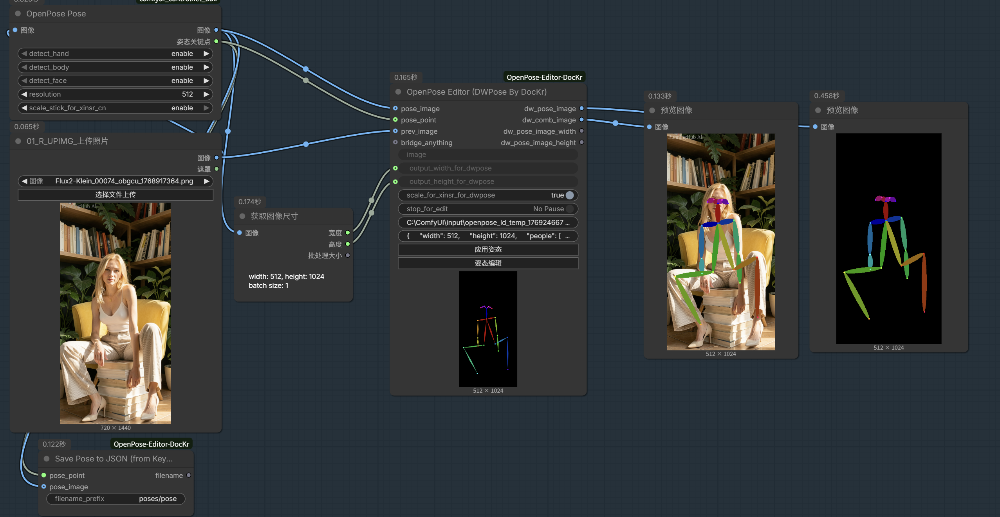
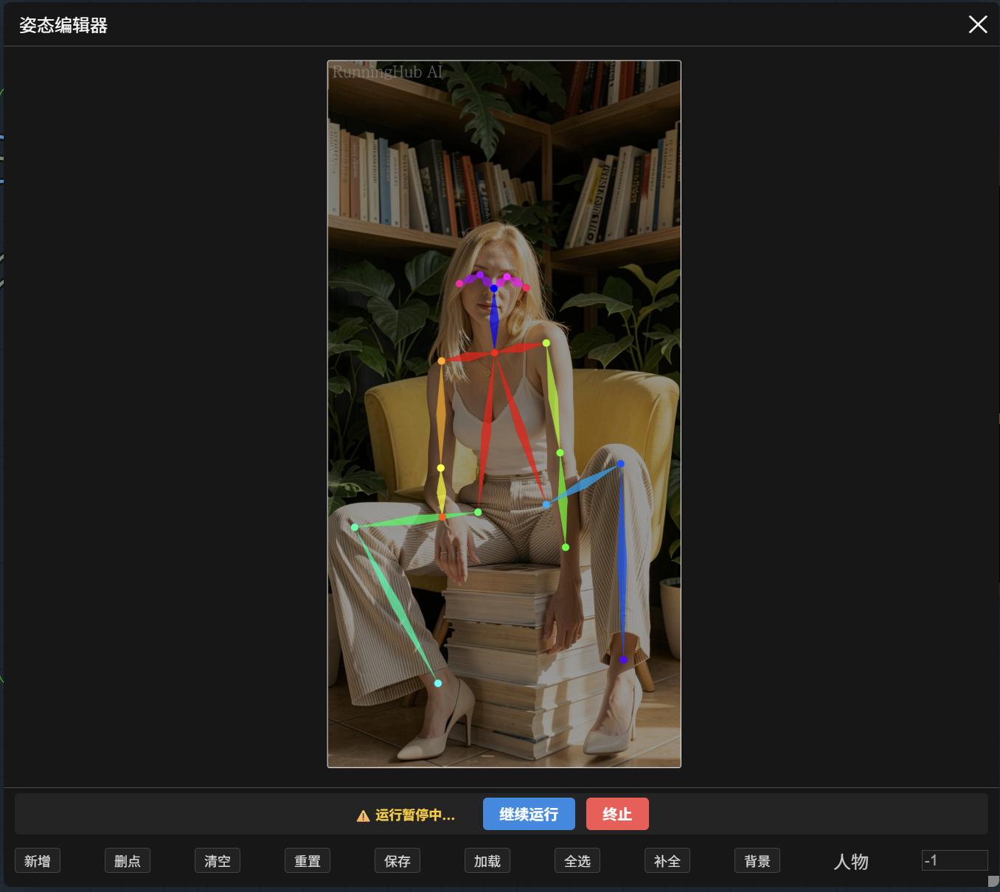

# ComfyUI OpenPose Editor (DocKr Optimized)

这是一个为 ComfyUI 设计的增强版 OpenPose 编辑器节点。由群内一位大佬朋友和我联合开发，由我代为发布，修复了交互问题，并增加了智能肢体补全、工作流暂停编辑等高级功能。

## ✨ 主要功能

*   **可视化姿态编辑**：在 ComfyUI 中直接打开画布，拖拽、添加、删除人体关键点。
*   **智能肢体补全**：提供 **“补全”** 按钮，根据现有关键点自动推断并补充缺失的对称肢体或关节（基于人体对称性和骨骼逻辑）。
*   **交互体验优化**：
    *   ✅ **修复鼠标中键拖拽**：原生支持按住鼠标中键拖拽画布，解决浏览器兼容性问题。
    *   支持 `Alt + 左键` 拖拽画布。
    *   支持鼠标滚轮平滑缩放。
*   **工作流深度集成**：
    *   **暂停/继续机制**：支持在工作流运行中接收暂停信号，弹出编辑器进行调整，点击“继续运行”将修改后的姿态传回后端继续生成。
    *   **自动同步**：实时将编辑器画布尺寸同步到节点输出 (`width`, `height`)，方便对接 DWPose 等节点。
    *   **背景图参考**：支持上传背景图片辅助姿态对齐。
*   **数据管理**：
    *   支持保存/加载 Pose JSON 文件。
    *   支持撤销 (`Ctrl+Z`) / 重做 (`Ctrl+Y`)。
    *   支持从节点的 `poses_datas` 属性直接加载和应用姿态数据。

## � 截图展示

### 1. 工作流深度集成


### 2. 暂停编辑模式


## 🛠️ 安装方式

### 方法一：使用 ComfyUI Manager (推荐)
直接搜索 `OpenPose Editor (DocKr)` 安装即可。

### 方法二：手动安装

1.  **进入节点目录**
    打开终端（CMD/PowerShell），进入你的 ComfyUI `custom_nodes` 目录：
    ```bash
    cd /path/to/ComfyUI/custom_nodes
    ```

2.  **克隆仓库**
    ```bash
    git clone https://github.com/DocWorkBox/ComfyUI-OpenPose-Editor-DocKr.git
    ```

3.  **安装依赖**
    进入插件目录并安装所需依赖：
    ```bash
    cd ComfyUI-OpenPose-Editor-DocKr
    pip install -r requirements.txt
    ```
    > **注意**：如果你使用的是 ComfyUI 便携版 (Portable)，请使用便携版环境下的 Python 执行 pip 命令：
    > ```bash
    > ..\..\python_embeded\python.exe -m pip install -r requirements.txt
    > ```

4.  **重启 ComfyUI**
    重启后即可在节点列表中找到 `Nui.OpenPoseEditor`。

## 📖 使用指南

1.  **添加节点**：在 ComfyUI 画布空白处双击，搜索 `OpenPoseEditor` (位于 `Nui` 分类下)。
2.  **打开编辑器**：点击节点上的 **"姿态编辑"** 按钮。
3.  **操作快捷键**：
    *   **移动关键点**：鼠标左键拖拽。
    *   **移动画布**：按住 **鼠标中键** 或 `Alt + 左键` 拖动。
    *   **缩放画布**：滚动鼠标滚轮。
    *   **全选**：点击工具栏“全选”按钮。
4.  **特色功能**：
    *   **补全**：当你只画了一半身体（如左手左脚）时，点击“补全”可尝试自动生成右侧对应的肢体。
    *   **应用姿态**：如果节点输入端连接了姿态数据，或 `poses_datas` 属性有值，点击“应用姿态”可将其加载到编辑器中。

## 🤝 贡献与反馈

本项目旨在提供更稳定、好用的 OpenPose 编辑体验。如果您在使用中遇到问题或有新的建议，欢迎提交 Issue。
